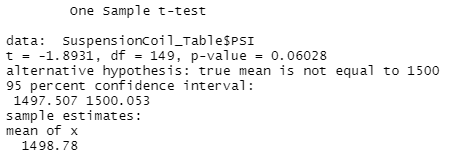
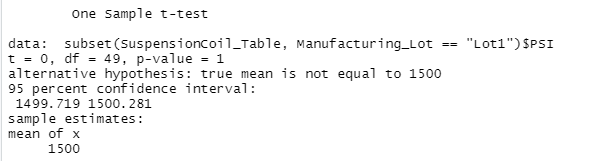
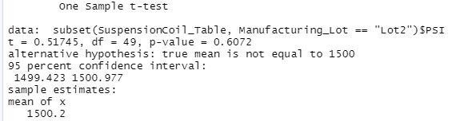
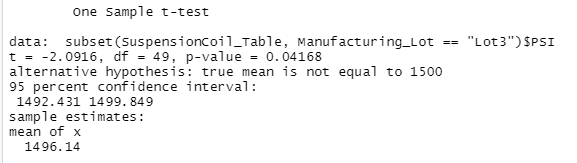

# MechaCar_Statistical_Analysis
Module 15 Challenge

# Overview

Jeremy is approached by upper management about a special project. AutosRUs’ newest prototype, the MechaCar, is suffering from production troubles that are blocking the manufacturing team’s progress. AutosRUs’ upper management has called on Jeremy and the data analytics team to review the production data for insights that may help the manufacturing team.

Jeremy needs assistance from his analytics team to perform multiple linear regression analysis to identify which variables in the dataset predict the mpg of MechaCar prototypes.  The team also needs to collect summary statistics on the pounds per square inch (PSI) of the suspension coils from the manufacturing lots and run t-tests to determine if the manufacturing lots are statistically different from the mean population. Then the team needs to design a statistical study to compare vehicle performance of the MechaCar vehicles against vehicles from other manufacturers. The team will need to provide a summary interpretation of the findings.

## Purpose

The purpose of this project is to use skills learned during this module to run analysis upon data using tool sets such as R through RScript to test for Linear Regression to Predict MPG, Summary Statistics on Suspension Coils and T-Test on Suspension Coils in aggregate and then seperated out by each lot.

## Linear Regression to Predict MPG

The methodology used is where the Pr(>|t|) value in the summary above represents the probability that each contribution may contribute a random amount of variance to the linear model.

Using the data set provided and after running a multi linear regression model, of the variables utilized in this model it is unlikely that the vehicle length and ground clearance are statistically unlikely to provided random amounts of variance to the linear model as their contributions seem to be more significant, especially when compared to other variables.  These two variables, length of vehicle and ground clearance seem to have a significant impact on miles per gallon.

Examining Pr(>|t|) value in the summary above, the slope of the linear model is **not zero** as the intercept **is** statistically significant.  This would mean that that the intercept value impact on the dependent variable is significant.  To help improve the model's ability to predict other variables impact on the dependent variable (mpg), one would need to determine if other variables not accounted for could be used to improve upon the model's ability to predict the variables impact upon the dependent variable.  In this case, vehicle_length and ground_clearance seems to have a significant impact but, there may be another variable associated to these variables that could better predict the impact upon the dependent variable.

Based on the Multiple R-square value method, anything with a R-square above a value of .7 and with a p-value that remained significant, the linear models ability to predict mpg is considered effective.  In this case, the Multiple R-squared value is **.7149** therefore making it an acceptable model for predicting mpg

## Summary Statistics on Suspension Coils

Based on the information provided to us, the design specifications for the MechaCar suspension coils dictate that the variance of the suspension coils must not exceed 100 pounds per square inch. Based on the summary table of all lots combined, we see that the variance is 62.29. Viewing all lots combined, the specification of less than 100 is met.  This information is good as a quick look, but to rule out the possibliity that lot to lot variation and deviation could be impacting the variance value of 62.29, we would need to look at each lot separately to determine any outliers.

After running a group_by and summarize code snippet across the lot data, it is evident by reviewing the image above that lots one and two have a variance of less than 100 while lot three has a lot variance of 170, which is above the acceptable lot variance of 100.

## T-Tests on Suspension Coils
 
Using T-Tests, we will use to hypothesis to verify the mean PSI of each lot. The hypothesis are as follows:
 
**NUll Hypothesis is that the true mean of the test sample is equal to 1500, with a p-value limit set to .05.**  Meaning, that if the P-value is greater than .05 (P > .05) we will fail to reject the hypothesis.  To explain in further detail, if the p-value is greater than .05 then based on the data available we cannot say that this sample data does not meet the mean parameter of 1500.
 
**Alternate Hypothesis is that the true mean of the test sample is not equal to 1500, with a p-value limit set to .05** Meaning, that if the P-value is less than .05 (P < .05) we are able to reject the hypothesis.  To explain in further detail, if the p-value is less than .05 then based on the data available we can say that this sample data does not meet the mean parameter of 1500.
 
When looking at the entire population of the data set, meaning not segregating data sets by manufacturing lots, we can see that all lots combined have a p-value of .06, which makes it greater than the .05 limit and therefore we fail to reject the null hypothesis that mean is equal to 1500.  By looking at all data combined, it appears that the mean is close to 1500.  Please see the screen snippet below:
 
 
 
However, it would be prudent to evaluate each manufacturing lot individually to see if there are any lots that may lead us to an alternate resolution.

By reviewing each lot on an individual basis, we can have better visibility of deviation from the mean of 1500.  Please see summary below.

For lot one, there is a p-value = 1.  It is greater than the p-value limit of .05 therefore we fail to reject the null hypothesis and determine based on the result from this dataset, that we are unable to determine that this lot varies significantly from the set mean of 1500.
 
 
 
Below, for lot two, there is a p-value = .6.  It is greater than the p-value limit of .05 therefore we fail to reject the null hypothesis and determine based on the result from this dataset, that we are unable to determine that this lot varies significantly from the set mean of 1500.
 
 
 
Below, for lot three, there is a p-value = .04.  It is less than the p-value limit of .05 therefore we are able reject the null hypothesis and accept the alternate hypothesis.  Based on the result from this dataset, we determine that this lot varies significantly from the set mean of 1500.
 
 
 
 
 ## Study Design: MechaCar vs Competition

For this deliverable, we would like to verify how MechaCar compares to competitor's equivalent model. For this analysis, we would keep in mind key metrics that are of interest to most customers when considering the purchase of a new vehicle.  These metrics of interest to the consumer would be cost, city or highway fuel efficiency, horsepower, options, maintenance cost, or safety rating.  Because MechaCar is a new model, we will be limited to the year over year data that we could use when comparing to the competitor but, we could leverage multi-year information from the competitor to identify consumer trends when it comes to cars that are comparable to MechaCar and their target markets.

Using competition data for the past 5 years to compare to the MechaCar, we could determine metrics of interest to the consumer.  They would be as follows: Please keep in mind that this metrics is not all inclusive as we are operating off a pair of hypotheses, therefore could change substantially as we evaluate the results and adjust an accurate model. 

**Dependent Variable**
 * Cost. In the end, the consumer would be concerned by cost as it relates to value. This would be a **Dependent Variable** as the other variables in the metric could have a direct impact upon cost.
  
 **Independent Variables**
 * Fuel efficiency
 * Options
 * Horsepower
 * Motor Type (Hybrid, Electric, Hydrogen, Gas, etc)
 * Maintenance Cost/Reputation
 * Safety Cost
 * Dealership Service and Support/Goodwill

### Hypothesis:
** Null Hypothesis (Ho):** MechaCar competitors key independent variables has no impact upon dependent variable (car price)
** Alternate Hypothesis (Ha):** MechaCar competitors key independent variables has an impact upon the dependent variable (car price)

Statistical Analysis to Validate Null and Alternate Hypothesis

As we have done with MechaCar to determine which variables have the greatest impact on MPG, we could run a similar analysis to identify which variables have the greatest impact on our competitor's car price and how those prices impact car sales for the competitor.  To do this, we would run a **Multiple Linear Regression** model.  This will allow us to do a comparitive analysis of the competitors vehicles to see which variable have the greatest impact on price and then upon sales. We can use this data to compare if those variables have similar impacts on MechaCar's price and sales.  Perhaps other variables are causing MechaCars having similar or higher prices to the competitor but do not translate into sales.

Then because MechaCar is new to the market, we do not have the benefit of historical data to assist with decision making.  Fortunately, we can use **T-Test Analysis** on competitor data to identify trends over the years to determine how the consumers buying habits have changed over the years.
