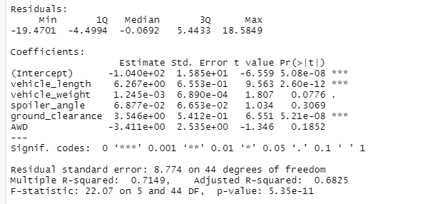
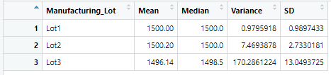

# MechaCar_Statistical_Analysis
Module 15 Challenge

## Linear Regression to Predict MPG

The methodology used is where the Pr(>|t|) value in the summary above represents the probability that each contribution may contribute a random amount of variance to the linear model.

Using the data set provided and after running a multi linear regression model, of the variables utilized in this model it is unlikely that the vehicle length and ground clearance are statistically unlikely to provided random amounts of variance to the linear model as their contributions seem to be more significant, especially when compared to other variables.  These two variables, length of vehicle and ground clearance seem to have a significant impact on miles per gallon.

Examining Pr(>|t|) value in the summary above, the slope of the linear model is **not zero** as the interecept **is** statistically significant.  This would mean that that the intercept value impact on the dependent variable is significant.  To help improve the models ability to predict other variables impact on the dependent variable (mpg), one need to see if other variables not accounted for could be used to improve upon the models ability to predict the variables impact upon the dependent variable.  In this case, vehicle_length and ground_clearance seems to have a significant impact but, there may be another variable associated to these variables that could better predict the impact upon the dependent variable.

Based on the Multiple R-square value method, anything with a R-square above a value of .7 and with a p-value that remained signficant, the linear models ability to predict mpg is considered effective.  In this case, the Multiple R-squared value is **.7149** therefore making it an acceptable model for predicting mpg

## Summary Statistics on Suspension Coils

Based on the information provided to us, the design specifications for the MechaCar suspension coils dictate that the variance of the suspension coils must not exceed 100 pounds per square inch. Based on the summary table of all lots combined, we see that the variance is 62.29. Viewing all lots combined, the specification of less than 100 is met.  This information is good as a quick look but, to rule out the possiblity that lot to lot variation and deviation could be impacting the variance value of 62.29, we would need to look at each lot seperately to determine any outliers.

After running a group_by and summarize code snippet across the lot data, it is evident from reiewing the image above that lots one and two have a variance of less that 100 while lot three has a lot variance of 170, which is above the acceptable lot variance of 100.

 ## T-Tests on Suspension Coils
 
 
 
 ## Study Design: MechaCar vs Competition
